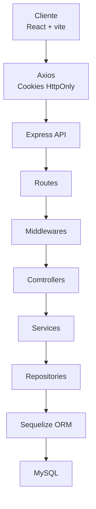
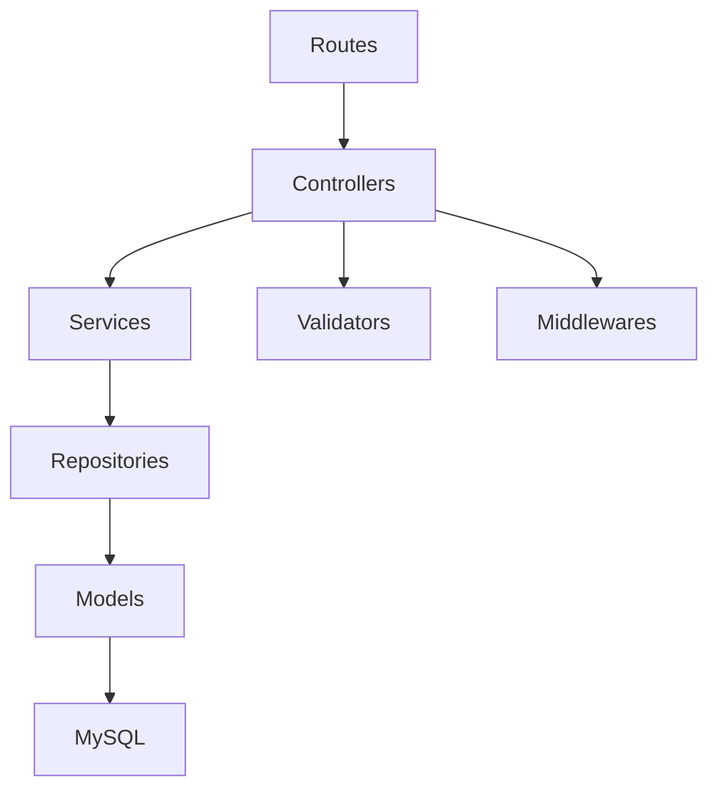
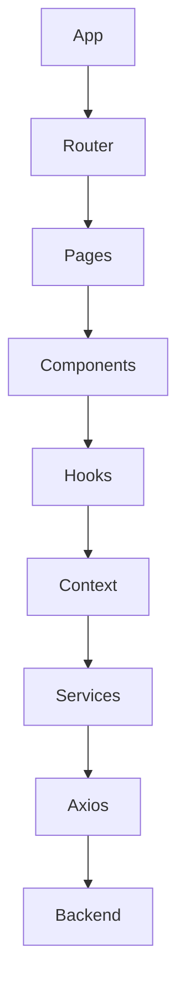

# Arquitectura del sistema - API Educativa
API Educativa utilizada una arquitectura desacoplada basada en:
- Backend REST API
- Frontend SAP
- bASE DE DATOS RELACINAL
- Autenticación mediante JWT
- Separación por capas
- Comunicación HTTP/JSPN

## Arquitectura general

## Arquitectura del Backend

### Rutes
Define los endpoints disponibles.
Ejemplo:
POST /api/auth/login
GET /api/auth/perfil

### Controllers
Recibe la petición HTTP y construye la respuesta.
Request
    ↓
Controller
    ↓
Service
    ↓
Response

### Services
Continene la ógica de negocio.
Ejemplo:
crearUsuario()
actualizarUsuario()
eliminarUsuario()

### Repositories
Se encargan del acceso a los datos.
Service
    ↓
Repository
    ↓
MySQL

### Models
Representan las tablas de la base de datos Sequelize.

## Arquitectura del Frontend

## Protección de rutas
Documentamos:
Frontend
|-PublicRoutes
|       |_Login
|-ProtectedRoute
|       |-Dashboard
|       |-Usuarios
|       |-Instrucciones
|       |-Sedes
|       |-Docentes
|       |_Cursos