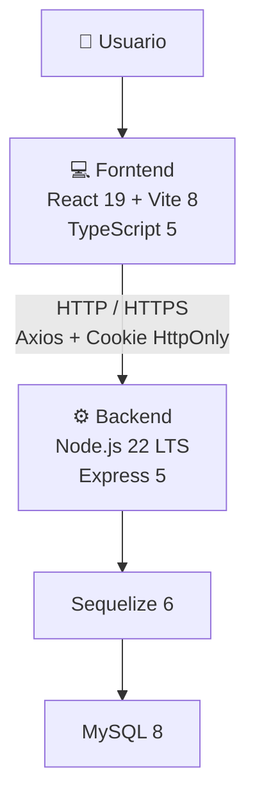
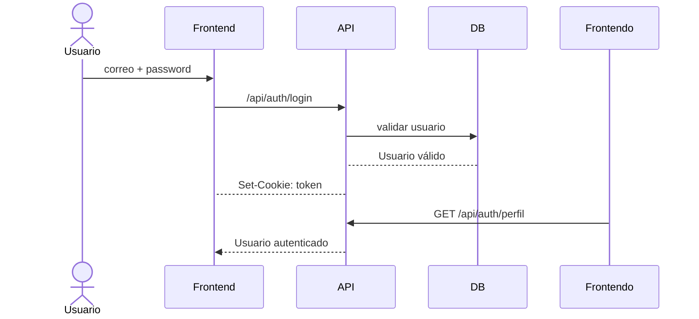

# API Educativa - stack Tecnológico oficial

## 1. Propósito
Este documento establece el stack tecnológico oficial del proyecto.
Su objetivo es garantizar que:

- Todos trabajen en versiones compatibles.
- El código corresponda a las versiones definidas.
- El proyecto pueda ser instalado nuevamente sin depender de cambios futuros de las librerias.
- Las actualizaciones de versiones se realicen de manera controlada.

---

# 2. Arquitectura tecnológica


# 3. Backend
## 3.1 Runtime
| Tecnología | Versión |
| ---------- | ------- |
| Node.js    | 22 LTS  |
| npm        | 11.x    |

## 3.2 Framework y servidor
| Tecnología | Versión |
| ---------- | ------- |
| Express    | 5.x     |

## 3.3 Base de datos
| Tecnología | Versión |
| ---------- | ------- |
| Mysql      | 8.x     |
| Sequelize  | 6.x     |

## 3.4 Seguridad
| Paquete            | Uso                            |
| ------------------ | ------------------------------ |
| jsonwebtoken       | Atenticación mediante JWT      |
| bcript             | Hash de contraseñas            |
| Cookie-parse       | Lectura de cookies             |
| Cors               | Comunicación Frntend ↔ Backend |
| heltmet            | Cabeceras HTTP de seguridad    |
| express-rate.limit | Limitación de solicitudes      |

# 4. Frontend
## 4.1 Core
| Tecnología | Versión |
| ---------- | ------- |
| React      | 19.x    |
| React Dom  | 19.x    |
| Vite       | 19.x    |
| TypeScript | 5.x     |

## 4.2 Interfaz
| Tecnología   | Versión                 |
| ------------ | ----------------------- |
| Tailwind CSS | 4.x                     |
| Lucide React | Compatible con React 19 |
| sonner       | Compatible con React 19 |

## 4.3 Navegación
| Tecnología       | Versión |
| ---------------- | ------- |
| React Router DOM | 7.x     |

# 4.4 Formularios
| Tecnologías         | Versión |
| ------------------- | ------- |
| React Hook Form     | 7.x     |
| Zod                 | 4.x     |
| @hookform/resolvers | 5.x     |

## 4.5 Comunicación con API
| Tecnología | Versión |
| ---------- | ------- |
| Axios      | 1.x     |

# 5. Herramientas de desarrollo
- Visual Studio Code
- Git
- GitHub
- Postman
- Mysql
- Navegador web

# 6. Versiones oficiales
- Las versiones principales que deben respetarse durante el desarrollo son:
```text
Node.js         22LTS
npm             11.x
React           19.x
Vite            8.x
TypeScript      5.x
Tailwind CSS    4.x
Zod             4.x
```

# 7. Verificación del entorno
### Node.js
```bash
node -v 
```
Resultado esperado:
```text
v24.15.0
```

### npm
```bash
npm -v
```
Resultado esperado:
```text
v11.16.0
```

### React
```bash
npm list react
```
Resultado esperado:
```text
web_frontend@0.0.0 D:\adso\Luis Fernando Gallego\App3315298\web_frontend
├─┬ lucide-react@1.29.0
│ └── react@19.2.8 deduped
├─┬ react-dom@19.2.8
│ └── react@19.2.8 deduped
├─┬ react-hook-form@7.84.0
│ └── react@19.2.8 deduped
├─┬ react-router-dom@7.18.2
│ ├─┬ react-router@7.18.2
│ │ └── react@19.2.8 deduped
│ └── react@19.2.8 deduped
├── react@19.2.8
└─┬ sonner@2.0.7
  └── react@19.2.8 deduped
```

### Vite
```bash
npm list vite
```
Resultado esperado:
```text
web_frontend@0.0.0 D:\adso\Luis Fernando Gallego\App3315298\web_frontend
├─┬ @tailwindcss/vite@4.3.3
│ └── vite@8.1.5 deduped
├─┬ @vitejs/plugin-react@6.0.4
│ └── vite@8.1.5 deduped
└── vite@8.1.5
```

### TypeScript
```bash
npm list typescript
```
Resultado esperado:
```text
web_frontend@0.0.0 D:\adso\Luis Fernando Gallego\App3315298\web_frontend
└── typescript@6.0.3
```

### Zod
```bash
npm list zod
```
Resultado esperado:
```text
web_frontend@0.0.0 D:\adso\Luis Fernando Gallego\App3315298\web_frontend
├─┬ @hookform/resolvers@5.7.1
│ └── zod@4.4.3 deduped
└── zod@4.4.3
```

# 8. Instalación del frontend
Crear el proyecto utilizando Vite:
```bash
npm create bite@8
```
Seleccionar:
```text
Framework: React
Variant: TypeScript
```
Instalar las dependencias:
```bash
npm install react-router.dom axios react-hook-form zod @hookform/resolvers lucide-react sonner clsx tailwind-merge
```
Tailwind CSS:
```bash
npm install tailwindcss @tailwindcss/vite
```

# 9. Instalación del backend
Instalar dependencias principales
```bash
npm install express cors helmet express-rate-limit morgan cookie-parser dotenv jsonwebtoken bcrypt sequelize mysql2
```

# 10. Variables de entorno
## Frontend
Archivo:
```text
.env
```
Ejemplo:
```env
VITE_API_URL = http://localhost:3000/api
```
## Backend
Archivo:
```text
.env
```
Ejemplo:
```env
DB_DIALECT=mysql
DB_HOST=localhost
DB_PORT=3307
DB_NAME= node_app3315298 
DB_USER=root
DB_PASSWORD=
PORT=3000
```
Los valores reales del archivo `.env` nunca deben subirse a github, se debe mantener un archivo:
```text
.env.example
```
sin credenciales reales.

# 11. Autenticación
La autenticación utiliza:
```text
JWT
+
Cookie HttpOnly
+Cors credentials
```
Flujo:


El JWT **No debe almacenarse en**:
```text
localStorage
sessionStorage
```
# 12. Axios
La instancia principal de Axios utilizará:
```ts
const api = axios.create({
    baseURL: import.meta.env.VITE_API_URL,
    withCredentials:true,
    headers:{
        "Content-Type":"application/json",
    },
});
```

`whitCredentials:true` permite que el navegador envie las cookies al backend cuando corresponde.

# 13. CORS
Durante desarrollo:
```javascript
app.use(
    cors({
        origin: "http://localhost:55173",
        credentials:true,
    })
);
```

En producción el origen debe cambiarse por el dominio real del frontend
No utilizar: cuando se requiere credenciales mediante cookies
```javascript
origin:"*"
```

# 14. Convenciones de TypeScript
Cuando se importe únicsmrnte un tipo:
```ts
import type { ReactNode } from "react";
```
Ejemplo:
```ts
import type { User } from "../types/auth";
```
esto es especialmente importante porque el proyecto utiliza:
```text
verbatimModuleSyntax
```

# 15. Validación con Zod
el proyecto utiliza Zod 4
Ejemplo:
```ts
import { z } from "zod";
export const loginSchema = z.object({
    correo: z.string().email("Correo inválido"),
    password: z.string().min(4, "Ingrese la contraseña"),
});
```
Los esquemas de validación estarán ubicados en:
```text
src/utils
```

# 16. Arquitectura Backend
```text
Routes
    ↓
Middlewares
    ↓
Controllers
    ↓
Services
    ↓
Repositories
    ↓
Models
    ↓
MySQL
```

# 17. Arquitectura Frontend
```text
Pages
    ↓
Components
    ↓
Hooks / Context
    ↓
Services
    ↓
Axios
    ↓
Backend API
```

# 18. Estructura Frontend
```text
src/
|-api/
|-assets/
|-components/
|   |-auth/
|   |-layout/
|   |-ui/
|-context/
|-hooks/
|-layouts/
|-pages/
|-routes/
|-services/
|-styles/
|-types/
|_utils/
```

# 19. Estructura Backend
```text
src/
|
|-config/
|-controllers/
|-middlewares/
|-models/
|-repositories/
|-router/
|-services/
|-validators/
|_utils/
```

# 20. Política de versiones
No se debe actualizar una dependecia principal sin comprobar:
1. Compatibildad.
2. Cambios de API.
3. Errores de TypeScript.
4. Errores de compilación.
5. Pruebas del proyecto.
6. Documentación.
Las actualizaciones mayores deben registrarse en:
```text
CHANGELOG.md
```
y actualizarse en:
```text
STACK.md
```

# 21. Reproducibilidad
El archivo:
```text
package-lock.json
```
debe mantenerse en el repositorio.
Para instalar exactamente las versiones registradas en el lockfile se recomienda:
```bash
npm ci
```
Para una instalación normal durante el desarrollo:
```bash
npm install
```

# 22. Reglas para el material eductivo
Todos los ejemplos, actividades y ejercicios del proyecto deberán utilizar el stack definido en este documento.
Si una versión cambia, primero se actualizará:
```text
STACK.md
```
y posteriormente se revisará el código afectado.

# 23. Estado del documento
**Proyecto:** API Educativa
**Versión:** 1.0.0
**Estado:** En desarrollo
**última actulización:** 10/09/2026